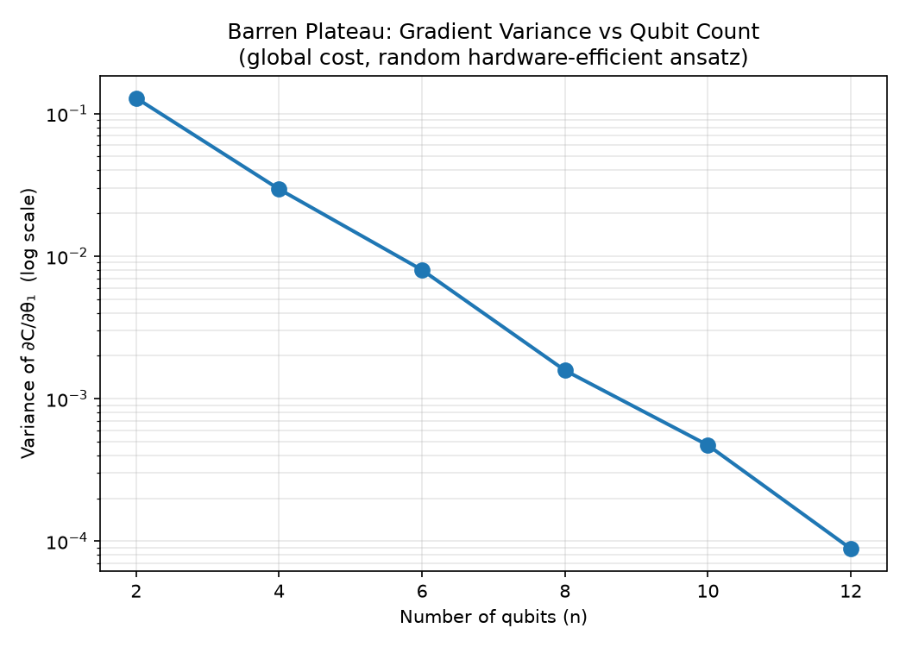

# An Empirical Study of Barren Plateaus in Variational Quantum Circuits

Independent research project investigating the **barren plateau phenomenon** in
variational quantum circuits — reproducing a foundational result from the
literature and extending it to study how cost function structure affects
trainability.

This project is part of my preparation for graduate research in quantum
information/computation theory, building on a background in experimental
biomaterials (MSc) and measurement-based quantum computing (IISER Mohali).

## Background

Variational quantum algorithms (VQE, QAOA, quantum neural networks) rely on
training parameterized quantum circuits with classical optimizers. McClean et
al. (2018) showed that for circuits approaching a random unitary 2-design, the
variance of the cost function gradient vanishes **exponentially** with the
number of qubits — a "barren plateau" that makes training intractable at
scale. Understanding when and why this happens, and how to avoid it, is a
central open problem in near-term quantum computing.

## Status: In Progress

- [x] Reproduce exponential gradient variance decay for a random
      hardware-efficient ansatz (McClean et al., 2018)
- [ ] Compare global vs. local cost functions and their effect on
      trainability (Cerezo et al., 2021)
- [ ] Final written report

## Key Result So Far

For a random hardware-efficient ansatz with a global cost function
(⟨Z⊗Z⊗...⊗Z⟩), gradient variance decays exponentially with qubit count:



Fitted slope: **-0.72**, closely matching the theoretical prediction of
**-0.693** (ln(1/2)) expected for an ideal unitary 2-design. Computed over
qubit counts 2–12 with 200 samples per data point.

## Repository Structure

```
├── src/
│   └── reproduce_barren_plateau.py   # main experiment script
├── results/
│   └── gradient_variance_vs_qubits.png
├── notebook.md                        # dated research log
└── README.md
```

## Setup

```bash
pip install pennylane numpy matplotlib
```

## Running the Experiment

```bash
cd src
python reproduce_barren_plateau.py
```

This will print a table of gradient variance vs. qubit count and save a plot
to `../results/gradient_variance_vs_qubits.png`.

## References

- McClean, J. R., Boixo, S., Smelyanskiy, V. N., Babbush, R., & Neven, H.
  (2018). Barren plateaus in quantum neural network training landscapes.
  *Nature Communications*, 9, 4812.
- Cerezo, M., Sone, A., Volkoff, T., Cincio, L., & Coles, P. J. (2021). Cost
  function dependent barren plateaus in shallow parametrized quantum
  circuits. *Nature Communications*, 12, 1791.

## Author

Bibhusita Baishya — MSc Physics, transitioning toward quantum information theory research.
